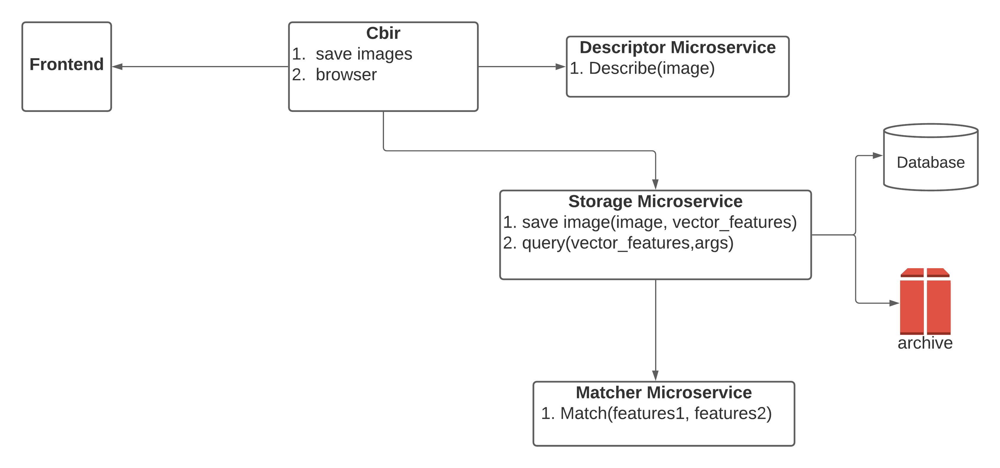

# Microservices with docker

* Project name: PLANT DISEASE DETECTION APPLICATION 
* Year: 2020
* Technologies: Fast API, Flask, Vuejs, Docker, docker-compose, microservices
* Repo: [Repo](https://gitlab.com/santiagoandre/plant-disease-detection-distributed)

This is a  distributed application for detect plants diseases, analyzing its leafs with cbir algorithms.

With this project you can learn a little about microservices and docker, this project is not fixed to production but is a base to the next step,  use Kubernetes to inprove the comunication between each mecroservices through Services like the lab docker coins.

Watch video demo in this link: [Demo](https://drive.google.com/file/d/1yJ8P0OgJG7bveV--vrLl3si31QeOavG-/view?usp=sharing).

<!-- <a href="{https://drive.google.com/file/d/1yJ8P0OgJG7bveV--vrLl3si31QeOavG-/view?usp=sharing}" title="Link Title"></a> -->


# Content-Based Image Retrieval (CBIR)

The 4 Steps of Any CBIR System

No matter what Content-Based Image Retrieval System you are building, they all can be boiled down into 4 distinct steps:

1. Defining your image descriptor: At this phase, you need to decide what aspect of the image you want to describe. Are you interested in the color of the image? The shape of an object in the image? Or do you want to characterize texture?
2. Indexing your dataset: Now that you have your image descriptor defined, your job is to apply this image descriptor to each image in your dataset, extract features from these images, and write the features to storage (ex. CSV file, RDBMS, Redis, etc.) so that they can be later compared for similarity.
3. Defining your similarity metric: Cool, now you have a bunch of feature vectors. But how are you going to compare them? Popular choices include the Euclidean distance, Cosine distance, and chi-squared distance, but the actual choice is highly dependent on (1) your dataset and (2) the types of features you extracted.
4. Searching: The final step is to perform an actual search. A user will submit a query image to your system (from an upload form or via a mobile app, for instance) and your job will be to (1) extract features from this query image and then (2) apply your similarity function to compare the query features to the features already indexed. From there, you simply return the most relevant results according to your similarity function.


# Architecture and flow

## Container diagram




This application is composed of Five microservices, each one complies with a specific responsibility of Content-Based Image Retrieval (CBIR) Flow. 

1. *Descriptor Microservice*: This microservice had one responsibility, describe an input image,  in other words, extract vectors, matrix of image with algorithms of DESCRIPTOR_DIC list. For this example, we use:
- Color descriptor
- Texture descriptor
- Color Tree
- SIFT
2. *Storage Microservice*: This microservice had two responsibilities, save image and vector descriptors, and query images from a features vector of input.

3. *Match Microservice*: This microservice had one responsibility, compare two features vectors of two images, and returns match percentage.
4. *Cbir Microservice*: This microservice fulfits the role of api and main functions two(view flow diagram).

5. *Frontend Microservice*: This small Microservice have two interfaces
    - Upload photos and her diseases
    - Browser similar photos of a leaf plant image, with its possible disease.

## Sequence diagram


## How to run this project

this project is dockerized, then is easy to use it with docker-compose, to run this project use this command


```
cd src
docker-compose up 
```

```yaml
version: "3.7"
services:
  db:
    image: mongo
    volumes:
      - $PWD/db_data:/data/db
  storage:
    build: storage
    environment:
      MONGO_URI: "mongodb://db:27017/cbir"
      MATCHER_URL: "http://matcher:8002/"
      UPLOAD_FOLDER: "static/uploads"
      PYTHONUNBUFFERED: 1
    volumes:
      - ./storage/static/:/app/static
      - ./storage/src:/app/src
    depends_on:
      - db
  api:
    build: api
    environment:
      STORAGE_URL: "http://storage:5000/"
      DESCRIPTOR_URL: "http://descriptor:8001/"
      PYTHONUNBUFFERED: 1
    volumes:
      - type: bind
        source: ./api/src
        target: /app/src
    links:
      - storage
    depends_on:
      - storage
  
  descriptor:
    build: descriptor
    environment:
      PYTHONUNBUFFERED: 1
    volumes:
      - ./descriptor/src:/app/src
    depends_on:
      - db
  matcher:
    build: matcher
    environment:
      PYTHONUNBUFFERED: 1
    volumes:
      - ./matcher/src:/app/src
    depends_on:
      - db
  frontend:
    build: frontend
    ports:
      - "8080:8080"
    environment:
      VUE_APP_API_URL: "http://api:8000/" 
    volumes:
      - ./frontend/:/app
        ./frontend/node_modules
        
    links:
      - api

```


