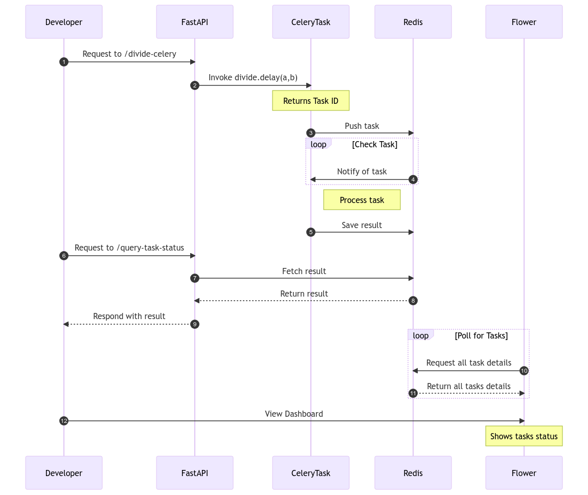

# Lab 1: FastAPI Integration with Celery and Redis

The objective of this lab is to demonstrate a basic integration of FastAPI with Celery and Redis for asynchronous task execution.
## Designs

### Container Design


### FLow Diagram


## Prerequisites

- Docker
- Docker Compose 

## Project Structure

```
.
├── docker-compose.yaml
├── main.py
├── Dockerfile.dev
├── .env.dev
├── README.MD
├── scripts/start_flower.sh
└── requirements.txt
```

## Description

- `main.py`: Contains the definition of a basic FastAPI API and a Celery task named `divide`.
- `Dockerfile.dev`: Specifies how to build the Docker image for the FastAPI application and the Celery worker.
- `.env.dev`: Configuration file that defines the environment variables used in `main.py`.
- `docker-compose.yaml`: Defines the necessary services to run the application and the Celery task.
- `scripts/start_flower.sh`: Has a code to start the flower container.

## Steps to Run the Lab

1. **Build and run services with Docker Compose**

   ```bash
   docker-compose up --build
   ```

2. **Access the FastAPI API**

   Once the services are up and running, you can access the FastAPI API at `http://localhost:8010`.

3. **Trigger a Celery Task**

   You can invoke the `divide` task by making a GET request to the `/divide-celery` route with parameters `a` and `b`. For example:

   ```
   http://localhost:8010/divide-celery?a=10&b=2
   ```

   The API will respond with a `task_id` which you can use to query the status and result of the task.

4. **Query the status of a task**

   Use the `/query-task-status` route with the `task_id` obtained from the previous step to check the status and result of the task:

   ```
   http://localhost:8010/query-task-status?task_id=YOUR_TASK_ID_HERE
   ```
## Flower

Flower is a real-time web application monitoring and administration tool for Celery.
Navigate to http://localhost:5550 in your browser of choice to view the dashboard. Click "Tasks" in the nav bar at the top to view the finished tasks.
## Conclusion

This lab showcases how to integrate FastAPI, Celery, and Redis for executing tasks asynchronously. It provides a foundation upon which more advanced and complex labs can be built.
