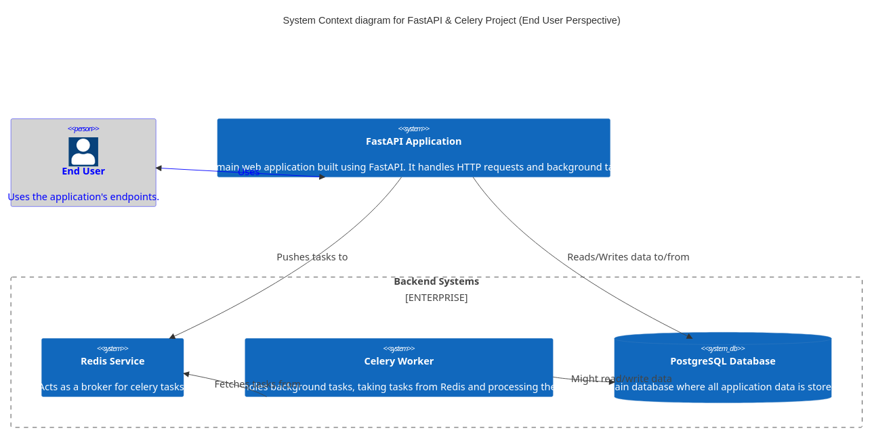

# Lab 2: FastAPI and Celery Integration Documentation

This documentation covers the integration of FastAPI with Celery, alongside tools like SQLAlchemy for database operations and Alembic for migration handling.

## Table of Contents
1. **Project Structure**
2. **Docker Compose Configuration**
3. **Web Service**
4. **Redis Service**
5. **Celery Worker Service**
6. **Flower Monitoring Service**
7. **Database Service**
8. **Setting Up and Running**

---
Certainly! Here's a dedicated section that explains the new structure of your project.

---
## Designs:

### User perspective 



### Developer perspective 


## Flow diagram

This app provides a simple api to manage users, when a new user is created, a new task to send registration email is added to celery queue


## 1. Project Structure Overview

In this laboratory exercise, we've introduced a more framework-centric structure that promotes modular design, scalability, and ease of maintenance. Let's break down the different components:

### Directory Structure:
```
.
├── alembic/
├── project/
│   ├── database.py
│   ├── celery_utils.py
│   ├── users/
│   └── config.py
├── scripts/
├── .env.dev
├── Dockerfile.dev
├── docker-compose.yaml
|   alembic.ini
├── main.py
└── requirements.txt
```

### Descriptions:

1. **alembic/**: 
   - This directory is dedicated to Alembic, our database migration tool. It contains migration scripts, configurations, and version history. This helps in maintaining a versioned history of our database schema changes.

2. **project/**:
   - **database.py**: This module sets up and configures our database connection and session using SQLAlchemy.
   - **celery_utils.py**: Utility for setting up and configuring the Celery instance for background task processing.
   - **users/**: A module-based directory focusing on user-related operations. This promotes modular design where each module (like users) can have its own models, views, and controllers.
     - **schemas.py**: Pydantic schemas for user-related requests and responses.
     - **tasks.py**: Celery tasks related to the users module.
     - **crud.py**: CRUD operations for the user model.
     - **models.py**: SQLAlchemy models for users.
   - **config.py**: Configuration settings for the project, making use of environment variables or default values.

3. **scripts/**:
   - Contains shell scripts which might be useful for bootstrapping, deployment, or task automation. For instance, `start_flower.sh` is present to bootstrap the Flower monitor for Celery.

4. **.env.dev**:
   - Environment-specific (development in this case) variables are stored here. They are used by Docker and can also be read within the application to configure certain settings.

5. **Dockerfile.dev**:
   - The Docker configuration file for creating a development environment container for our application.

6. **docker-compose.yaml**:
   - Docker Compose configuration that helps in defining and running multi-container Docker applications. This is where services like the web application, database, Celery worker, and others are defined.

7. **main.py**:
   - The entry point to our FastAPI application. This is where the application instance is created and routes are included.

---

## 2. Docker Compose Configuration

The `docker-compose.yaml` file contains definitions for various services:

- **web**: The main FastAPI application.
- **redis**: The Redis broker for Celery.
- **celery_worker**: The Celery worker service.
- **flower**: A monitoring tool for Celery.
- **db**: PostgreSQL database service.

---

## 3. Web Service

The web service runs the FastAPI application:

- Uses the `Dockerfile.dev` for building the Docker image.
- Sets the command to run FastAPI with `uvicorn`.
- Maps port `8010` on the host to port `8000` on the container.
- Depends on the `redis` and `db` services.

---

## 4. Redis Service

Redis is used as the message broker for Celery:

- Uses the official Redis image (`redis:7-alpine`).

---

## 5. Celery Worker Service

This service processes tasks asynchronously:

- Uses the same Docker image as the web service.
- Runs the Celery worker with the appropriate configurations.
- Depends on the `redis` service for task management.

---

## 6. Flower Monitoring Service

Flower is used to monitor and manage Celery tasks:

- Uses the same Docker image as the web service.
- Runs a shell script to initiate Flower.
- Maps port `5550` on the host to `5555` on the container.
- Depends on the `redis` service.

---

## 7. Database Service

The database service uses PostgreSQL:

- Utilizes the `postgres:12` Docker image.
- Stores data in a Docker volume named `postgres_data` to persist data.
- Sets up the database with provided environment variables (username, password, dbname).

---

## 8. Setting Up and Running

To get the project up and running:

1. Install Docker and Docker Compose.
2. Navigate to the project directory.
3. Run `docker-compose up -d` to start all services in detached mode.
4. Access the FastAPI application at `http://localhost:8010`.
5. Monitor Celery tasks using Flower at `http://localhost:5550`.


## 9. Alembic: Database Migrations

### Introduction

[Alembic](https://alembic.sqlalchemy.org/en/latest/) is a lightweight database migration tool for usage with the SQLAlchemy database toolkit. It provides a way to programmatically manage changes in your database schema, ensuring that your database schema is in sync with your SQLAlchemy models. By using migrations, you can maintain a history of changes, which can be very helpful for things like data integrity, database versioning, and collaborative development.

### Setup

Your project already includes an `alembic/` directory, which contains configuration, migration scripts, and version history. The primary configuration is in `alembic.ini`, which references `alembic/env.py` to determine the database connection, dependencies, and more.

### Generating Auto-Migrations

1. **Auto-generate Migration Script:**  
After modifying your SQLAlchemy models, you can auto-generate migration scripts by running:  
```bash
alembic revision --autogenerate -m "Description of the changes"
```
For example, if you added a new column to a user model, you might run:  
```bash
alembic revision --autogenerate -m "Added age column to user model"
```
This command will detect changes in your models and generate a new migration script under `alembic/versions/`.

2. **Review the Migration Script:**  
It's a good practice to review the generated migration script to ensure it captures all the changes and to make any necessary tweaks.

### Applying Migrations

1. **Upgrading to the Latest Migration:**  
To apply the migrations and update the database schema, run:  
```bash
alembic upgrade head
```
This command will apply all pending migrations up to the latest version.

2. **Downgrading Migrations:**  
If you need to undo a migration, you can downgrade. For example, to undo the last migration, you can run:  
```bash
alembic downgrade -1
```
To downgrade to a specific migration version, replace `-1` with the version number (found in the filename of the migration script).
