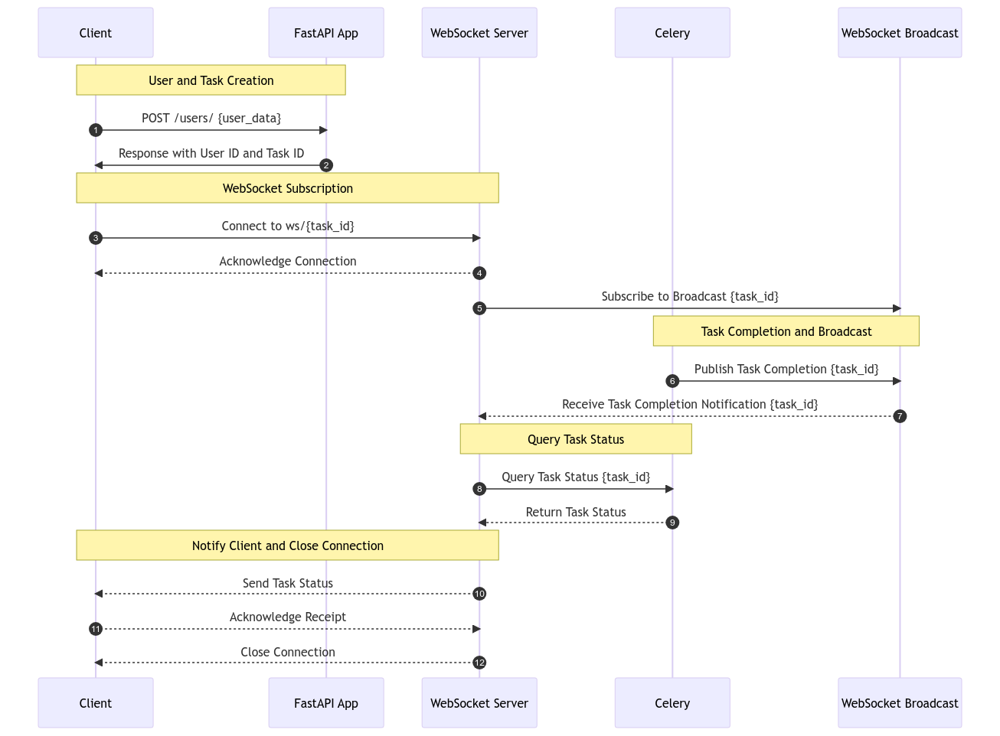

# Lab 5:  WebSocket With Celery

### Overview

Our FastAPI application has been enhanced with a new WebSocket module, bringing real-time capabilities to our service. This update primarily revolves around providing live updates on task statuses.
### How It Works

#### Background Perspective

In the backend, when a user is created or a task is initiated, our FastAPI app communicates with the database and Celery. Once a task is handed over to Celery, it is executed in the background. Upon completion, the task's post-run handler updates the task status which is then broadcasted through WebSocket to any subscribed clients.

Key components involved:
- **FastAPI App:** Handles user creation and task initiation.
- **Celery:** Executes background tasks and notifies on completion.
- **WebSocket:** Broadcasts real-time updates to clients.

#### User Perspective

From the user's perspective, upon initiating a task (such as user creation or sending an email), they receive a task ID and can connect to a WebSocket endpoint to receive live updates about the task status. This connection keeps the user informed in real-time until the task is completed.

The flow involves:
- **Client to FastAPI App:** Requesting task initiation.
- **FastAPI App to Client:** Providing task details.
- **Client to WebSocket:** Subscribing for updates on the task.
- **WebSocket Broadcast:** Notifying client of task status updates.

### Technical Implementation

#### WebSocket Routes

The WebSocket functionality is facilitated through routes defined in `ws_router`. Key routes include:
- `/form_ws/`: Displays a form for user interaction.
- `/ws/task_status/{task_id}`: WebSocket endpoint for receiving task status updates.

#### Frontend Integration

The user interface interacts with these WebSocket endpoints. The frontend script handles form submission and WebSocket communication, providing a seamless experience for monitoring task progress.

## Testing the WebSocket Endpoint

### Endpoint Overview

The WebSocket endpoint at `http://localhost:8010/form_ws/` provides a user interface for submitting data and observing real-time updates about the processing status via WebSockets. This form is a part of a Celery-based task processing system.

### How to Use

1. **Accessing the Endpoint:**
   - Navigate to `http://localhost:8010/form_ws/` in your web browser. You will see a form with fields for email, username, and password.

2. **Submitting the Form:**
   - Fill in the fields with appropriate data.
   - Click the 'Submit' button.
   - Upon submission, the form data is sent to the server using a POST request to the `/users/` endpoint.

3. **WebSocket Interaction:**
   - When the form is submitted, a WebSocket connection is established to `/ws/task_status/[task_id]`, where `[task_id]` is a unique identifier for the task generated by the server.
   - The page displays real-time updates about the task status (e.g., 'Processing...', 'Success', or any error messages) below the form.
   - Once the task reaches a final state ('SUCCESS' or 'FAILURE'), the WebSocket connection is closed.

4. **Front-End Behavior:**
   - The form uses Bootstrap for styling and layout.
   - JavaScript is utilized to handle form submission, WebSocket communication, and updating the UI based on the task's progress and status.

