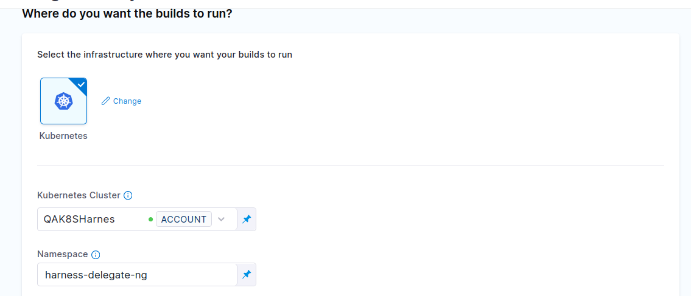
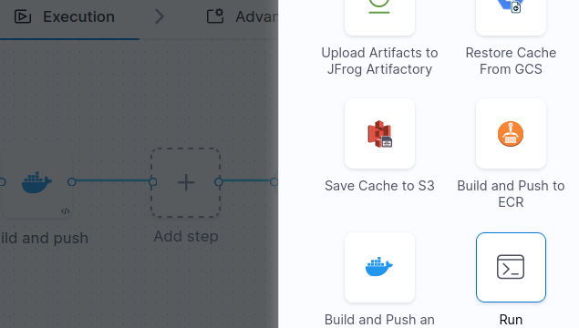
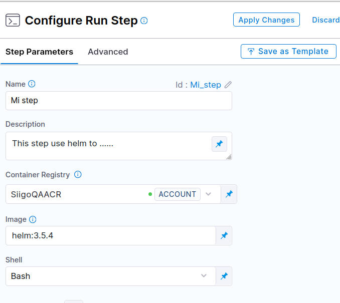
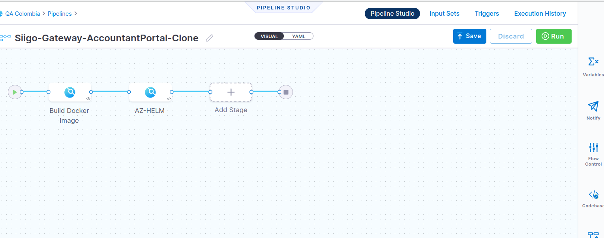
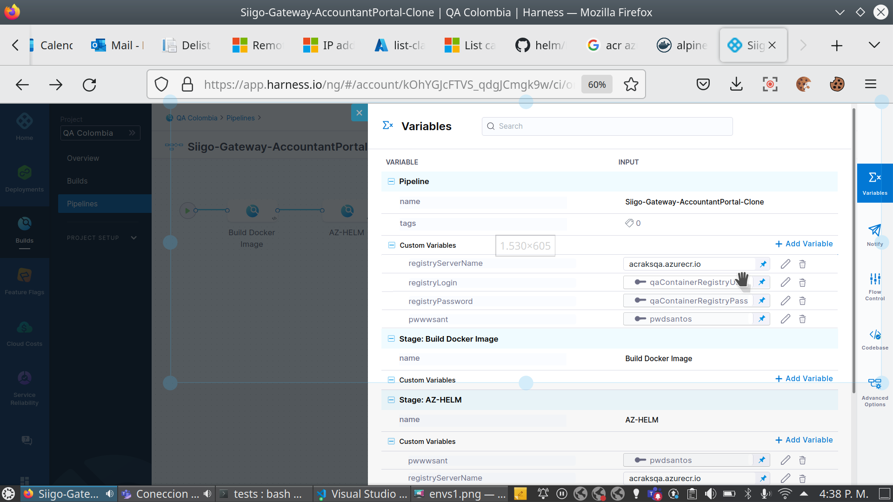

# Introduccion

Siigo tiene el objetivo de migrar los pipelines alojados en azure devops a una nueva plataforma llamada harness, harness provee mas funcionalidades como `CCM`, etc.
Actualmente se estan alojando todas las cosas relacionadas a los pipelines de harness en el siguiente [Repositorio](https://dev.azure.com/SiigoDevOps/Siigo%20SRE/_git/Harness.SREDevCloudOps){target=_blank}
 
 
 
# Helm Pipeline en Harness
 
El contenido de este readme está segmentado en:

- Dockerizacion  de las imágenes necesarias para la ejecución del pipeline
- Envío  de estas imágenes al container registry de siigo.
- Uso de estas imágenes en un pipeline de Harness
- Diferentes configuraciones en harness como:
   - Definición de variables de entorno
   - Parámetros de entrada al pipeline
   - Variables propias de harness <+env>
 
 
## Dockerizacion de Helm y az cli
 
En el pipeline solicitado se requería helm y azure cli, por lo que necesitamos imágenes de docker con estas herramientas, en este paso se explica cómo generarlas.
 
### Opción 1 Compilar un Dockerfile
En este caso se obtuvo el Dockerfile oficial de [helm](https://github.com/alpine-docker/helm/blob/master/Dockerfile) 
y se compiló con el siguiente comando
 
```bash
$ docker build . --build-arg HELM_VERSION=3.5.4 -t acraksqa.azurecr.io/helm:3.5.4
#HELM VERSIÓN es un argumento de entrada en el Dockerfile
#El parámetro -t recibe el nombre que se le pondrá la imagen, se debe tener en cuenta la siguiente estructura, es necesaria en el siguiente paso:
# contrainer_registry/name:tag
```
 
### Opción 2 Bajar y renombrar la imagen de otro ACR
En este caso se baja la imagen de helm del ACR oficial, y después se renombre con la estructura requerida.
```bash
$ docker pull alpine/helm:3.5.4
$ docker image tag   alpine/helm:3.5.4 acraksqa.azurecr.io/helm:3.5.4
```
 
 
## Envío de imagen a el ACR DE Siigo
Después de crear la imagen con la estructura requerida `contrainer_registry/name:tag`, se debe autenticar en el acr de siigo y hacer un push
```bash
$ docker login acraksqa.azurecr.io -u {user} -p {password}
$ docker push acraksqa.azurecr.io/helm:3.5.4
2fde7f95afdf: Layer already exists
7d06d46f4102: Pushing [>                                                  ]  8.015MB/899.7MB
fb190e4954e7: Pushing [===============================>                   ]  12.06MB/18.98MB
07970fbbd16c: Layer already exists
4cd9d85546e1: Pushing [==================================================>]  3.782MB
21e6822647b4: Pushing [>                                                  ]  3.192MB/223.5MB
5a73e7de9c96: Pushing [================>                                  ]   3.36MB/10.16MB
b8cacc2e2c3b: Waiting
11e10081c87a: Waiting
d6cf9dabd86a: Waiting
ff768a1413ba: Waiting
```
 
 
## Uso de la imagen desde Harness
Para este laboratorio se usó el pipeline `Siigo-Gateway-AccountantPortal-Clone`, se siguieron lo siguientes pasos:

1. Crear un stage tipo `Build`.
2. En la sección infraestructura se seleccionó la siguiente configuración

3. En la pestaña de ejecución se pueden elegir los steps a ejecutar; hay varios tipos de steps para hacer diferentes cosas, en este caso se escoge un step de tipo `Run`

4. Configuración del step, se usó la siguiente configuración

- Name: El nombre que representativo del step
- Description: Descripción de lo que hace el step
- Container Registry: Harness ya tiene configurada la conexión al ACR de QA(trabajo realizado por David),por lo que solo se debe seleccionar:
`Select > Account > SiigoQAACR > Apply selected`
- Image: el nombre de la imagen sin el ACR, en este caso la imagen creada en el primer paso    `helm:3.5.4`
- Shell: Se seleccionó `Bash`
- Command: El comando a ejecutar, en este caso se ejecutaron varios, entre esos:

```bash
# stage 1
<+pipeline.variables.excecute_step_1> == "true"
# stage 2
<+pipeline.variables.excecute_step_2> == "true"
 
#pipeline.variables.excecute_step_1 y pipeline.variables.excecute_step_2 son variables del pipeline
```

```bash

helm repo add registrysiigo https://$registryServerName/helm/v1/repo --username $registryLogin --password $registryPassword
helm dependency update ./.docker/$projectName
mkdir ./artifacts
helm package --version <+pipeline.sequenceId> --destination ./artifacts ./.docker/$projectName
az acr helm push -n $registryServerName  ./artifacts/$projectName-<+pipeline.sequenceId>.tgz
```
Aquí puedes colocar los comandos que necesites, siempre y cuando los comandos existan dentro de la imagen de docker
 
## Diferentes configuraciones en harness
### Variables de entorno
Las variables de entorno son las conocidas variable de configuración que define el desarrollador, estas pueden contener datos confidenciales, o simples datos de configuración

En el menú derecho aparece una opcion `Variables` con el signo de sumatoria, ahí se pueden configurar estas variables

- En el apartado `Pipeline` se pueden configurar las `Custom Variables` del proyecto en general.
- En el apartado `Stage: Build Docker Image` se pueden configurar las `Custom Variables`accesibles solo en esa stage.
- En el apartado `Stage: AZ-HELM` se pueden configurar las `Custom Variables`accesibles solo en esa stage.
 
La forma de usar estas variables es colocando el signo `$` seguido del nombre de la variable como es el caso de las variables
- `$registryServerName`
- `$registryLogin`
- etc
 
## Parámetros de entrada al pipeline
Los parámetros de entrada se definen en cada ejecución, en este caso `projectName` debería ser un parámetro de entrada y no una variable de entorno
 
`Pendiente`
 
## Variables propias de Harness
Las variables propias de harness son variables que maneja Harness y permiten conocer cierta información como id de ejecución, configuración de Kubernetes y otros servicios.
se acceden de la siguiente forma `<+varname>`:
```
<+pipeline.sequenceId>
```
 
 

