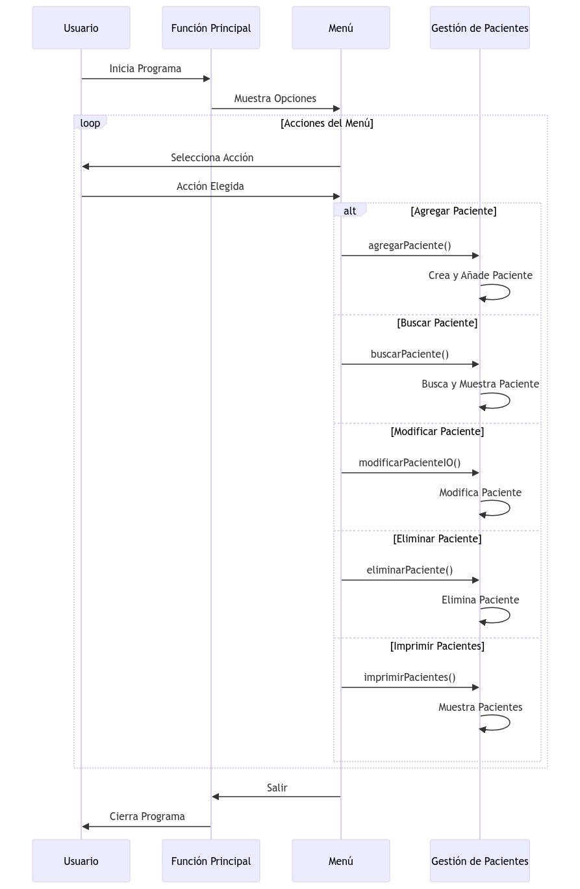

# Lists In Haskell

* Year: 2019
* Technologies: Programacion funcional con Haskell.
* Repo: [Repo](https://gitlab.com/santiagoandre/list-in-haskell)

Este proyecto lista de pacientes, permitiendo realizar varias operaciones como agregar, buscar, modificar y eliminar pacientes. Además, calcula el IMC de cada paciente y los clasifica en categorías como peso normal, sobrepeso u obesidad.

### Módulos y Estructuras de Datos

El proyecto consta de varios módulos y estructuras de datos principales:

1. **Tipos de Datos:**
   - `Genero`: Representa el género del paciente.
   - `DiagnosticoIMC`: Enumeración para las categorías de IMC.
   - `Paciente`: Estructura para almacenar la información del paciente.

2. **Funciones Principales:**
   - `imcCalcule`: Calcula el IMC.
   - `diagnosticoIMC`: Determina la categoría del IMC.
   - `main`: Función principal que inicia la aplicación.

3. **Acciones del Menú:**
   - Funciones para agregar, buscar, alertar sobre pacientes con IMC específicos, modificar, eliminar e imprimir información de pacientes.

### Diagrama de flujo

### Implementación Detallada

1. **Definición de Tipos de Datos:**
   - Los tipos `Genero` y `DiagnosticoIMC` usan el sistema de tipos algebraicos de Haskell para definir enumeraciones.
   - La estructura `Paciente` usa el tipo de datos `data` para definir un registro.

2. **Cálculo del IMC y Diagnóstico:**
   - `imcCalcule` toma peso y altura para calcular el IMC.
   - `diagnosticoIMC` clasifica el IMC en categorías.

3. **Función Principal (`main`):**
   - Inicia la aplicación y maneja el flujo del menú principal.

4. **Acciones del Menú:**
   - `agregarPaciente`: Agrega un nuevo paciente a la lista.
   - `buscarPaciente`: Busca un paciente por cédula.
   - `buscarAlertas`: Encuentra pacientes con IMC en categorías específicas.
   - `modificarPacienteIO`: Modifica el peso o la estatura de un paciente.
   - `eliminarPaciente`: Elimina un paciente de la lista.
   - `imprimirPacientes`: Muestra todos los pacientes.

5. **Funciones Auxiliares:**
   - Funciones para seleccionar género, peso, estatura y manejo de opciones del menú.

### Uso y Ejecución

Para usar el programa, el usuario interactúa con un menú de consola que permite realizar las diferentes operaciones. La aplicación mantiene una lista de pacientes en memoria, que se modifica con cada operación.

### Observaciones Adicionales

- El código hace un uso intensivo de funciones puras y manejo de IO en Haskell.
- Se utiliza pattern matching y funciones de orden superior para operaciones sobre listas.

### Conclusión

Este proyecto demuestra una aplicación práctica del lenguaje funcional Haskell en la gestión de datos de pacientes y cálculo de IMC. Combina conceptos de programación funcional como inmutabilidad, tipos de datos algebraicos y manejo de entrada/salida.

