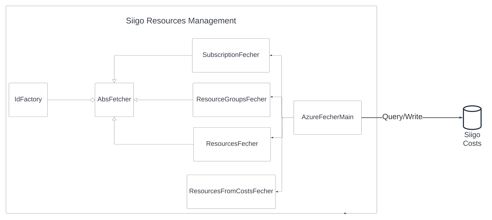
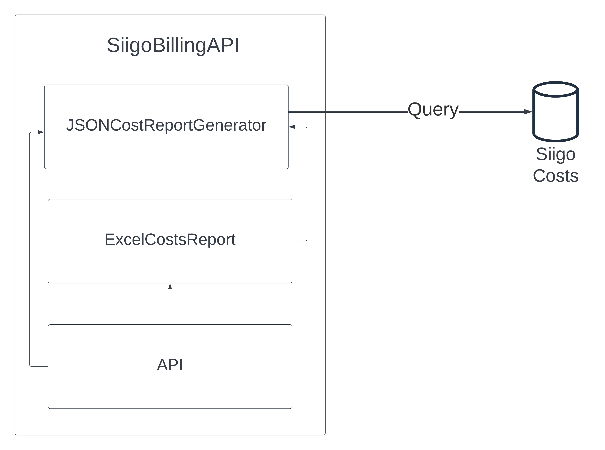

# Siigo Costs

La aplicacion tiene el objetivo de procesar  y guardar los costos de infraestructura de `Siigo SAS`, de los diferentes clouds `azure`, `aws`, `oracle`,  por medio de diferentes providers como `rocket`, `azure costs management`, `aws cost`, para poder  generar metricas, indicadores, reportes, donde se puedan ejecutar analisis y de forma oportuna poder  responder preguntas como:

- Donde y porque se incrementaron los costos este mes.
- Determinar que parte del incremento de costos es de nueva infra y de infra existente.
- Es el dia 7, 15, etc. del mes y quiero saber cuales son los recursos que incrementaron sus costos lo que lleva del mes.
- Cual sera el costo de x recursos el mes que viene(Predicciones avanzadas).
- Cual es el costo exacto de la nueva infraestructura desplegada este mes.
-  Llevar un historico de los costos tambien es algo muy valioso, ya que con esto podremos ver como cambian los costos  de un recurso, grupo de recursos  a lo 
largo del tiempo.
- Cual es el descuento exacto que aplico rocket para cada tipo de recurso el mes que paso.

## Diagrama de arquitectura

<!--  -->
<!--  -->


La aplicacion se compone de 3 componentes principales:

- **Siigo Resources Management**: Tiene como objetivo bajar los recursos que estan desplegados en los diferentes clouds(en este momento solo azure), ya que en los informes de costos se quiere obtener la informacion de cada recurso(tipo, locacion, sku, etc.) como tambien los  tags(owner, tribu, product, solution). 


- **Siigo Cost Procesor**: Tiene como objetivo bajar los costos de infraestructura de  los recursos que estan desplegados en los diferentes clouds, por medio de diferentes providers, como `Rocket`, `Azure Cost Management`, `AWS Costs`, para luego procesarlos, agruparlos y relacionarlos a los recursos que estan guardados en la base de datos. El objetivo es bajar los costos en intervalos establecidos teniendo en cuenta las restricciones de cada provider, por ejemplo: cada mes, cada semana, cada 15 dias.


- **Siigo Cost API**: Es un API enfocada 100% a consultas sobre la info en la db, tiene como objetivo generar diferentes informes de costos, por subscripcion, grupo de recursos, recursos, providers, etc, como tambien de recursos, en `excel` o `json`.

-  **POWER BI**: Esta tecnologia externa nos ayudara a analizar la informacion de una forma mas sencilla, con graficos, consultas complejas etc, power bi tiene las opciones de obtener datos de un API o una db, en este caso MongoDB. 

### Siigo Resources Management


Por el momento este componente solo baja **NUEVOS RECURSOS**, mas adelante podria ser capaz de  determinar si un recurso ha sido **ELIMINADO** o **ACTUALIZADO**, y reflejarlo en la db.

- **Id Factory**: Este componente tiene el objetivo de generar id aleatorios para cada nuevo recurso o grupo de recursos o sub, en un principio se pensaba generar un tag `_id`, en azure para que este se identificara a traves de este tag, pero nunca se ejecuto. 

- **Subscription Fetcher**: Este componente tiene el objetivo de consultar las subscripciones de azure a traves del api, procesarlas y retornarlas en formato json.

- **Resource Groups  Fetcher**: Este componente tiene el objetivo de consultar los recursos de azure a traves del api, procesarlos y retornarlas en formato json.

- **Resources Fetcher**: Este componente tiene el objetivo de consultar los recursos  de azure a traves del api, procesarlos y retornarlas en formato json.


- **Resources From Costs  Fetcher**: Este componente existe debido a que no es posible obtener todos los recursos que existieron en un mes  con los tres componentes anteriores, ya que el API `Azure Resource Management` de azure solo retorna los que existen en el momento que se hace la peticion. Este componente extrae todos los recursos y grupos  de recursos no existentes en la db que vienen en la respuesta de `Azure Cost Management` los procesa y retorna en en formato json.<br/>
Cabe aclarar que  usando logica difusa se determina cual es el `Service Name` para cada recurso, ya que en la respuesta de costos para un mismo recurso normalmente vienen registros con diferentes  `Services Names`(Un problema de ambiguedad). Este proceso se pudo validar en una PoC comparando los resultados con el portal de `Azure` y se encontro que funciona correctamente para un grupo mediano de datos.
- **Azure Fetcher  Main**: Este componente tiene el objetivo de llamar a los diferentes fetchers y posteriormente guardar la informacion en la base de datos.

### Siigo Costs Processor


Este es un disenio simplificado de este modulo, este componente consulta en este momento informacion de costos directamente de `Azure` y de `Rocket`, los procesa y guarda en la base de datos.

- **Rocket Cost API**: Este componente se comunica con el API de Rocket y consulta los costos por recurso de una `Suscripcion` y `Periodo` determinado Ej: `2022-02`,`2022-03`. Finalmente retorna los costos en formato `JSON`.<br/>
**Nota:** Los costos solo se pueden consultar con periodos pasados, y no hay forma de consultar en otros periodos de tiempo.

- **Azure Cost API**: 
Este componente se comunica con el API de `Azure Cost Management` y consulta los costos por recurso en un intervalo de tiempo. Por ejemplo:   desde `2022-07-1` hasta `2022-07-15`. Finalmente se retornan los costos en formato `JSON`. <br/>
**Notas:** 
    - *En `Azure Cost Management` se pueden consultar los costos en cualquier intervalo de tiempo en el pasado, es decir puedo hacer consultas en intervalos como: [`2022-07-1`, `2022-07-15`]. Tambien es posible consultar los costos del dia inmediatamente anterior.* <br/>
    - *Por el momento solo se generan costos mensuales  pero mas adelante se generaran  costos cada semana(Solo de Azure).* 
- **Cost Processor**: Hay un `Cost Processor` por cada provider de costos, y tiene el objetivo de procesar los costos obtenidos del provider guardarlos en la base de datos. Todos los `Cost Processor` guardan la informacion en la misma tabla de la db con el mismo formato. A modo de resumen el procesamiento es encontrar el recurso asociado y el costo total para cada recurso que aparezca en la respuesta del provider.<br/>
`Ejemplo de Tabla de costos`:<br/>

| Provider | Resource Id                          | Cost       | Month | Year | Week |
|----------|--------------------------------------|------------|-------|------|------|
| Azure    | ObjectId("62cc9c1218d23b62caf89d66") | 1222.12121 | 04    | 2022 | 1    |
| Rocket   | ObjectId("62cc9c1218d23b62caf89d66") | 1423.232   | 04    | 2022 | 2    |
| Rocket   | ObjectId("62cc9c1218d23b62caf89d66") | 1011.2121  | 04    | 2022 | 2    |
                     
- **Azure Cost Processor**:   
Para procesar los costos de `Azure Cost Management` se debe hacer una agrupacion ya que los costos vienen segmentados, para calcular el costo de un solo recurso hay que agrupar al menos 6 registros sumando el costos. Para poder determinar que registros son del mismo recurso se hace uso de expresiones regulares sobre el `Resource Id` de cada registro en la respuesta de azure.

```json title="Ejemplo de los costos segregados para un mismo recurso"
[
  [
        12.8898304,
        "extensionappservice",
        "microsoft.compute/virtualmachines",
        "us central",
        "subscriptions/b2fd9f8c-0ed5-4f6e-9c93-75ae90718afa/resourcegroups/rgvmtemprdp/providers/microsoft.compute/virtualmachines/alidostech-4",
        "Bandwidth",
        "USD"
    ],
    [
        0.016945401057600975,
        "extensionappservice",
        "microsoft.web/disks",
        "us central",
        "/subscriptions/b2fd9f8c-0ed5-4f6e-9c93-75ae90718afa/resourcegroups/rgvmtemprdp/providers/microsoft.compute/disks/alidostech-4_disk1_63e1110a0cbf410aaa7e374487b1e5d5",
        "Disks",
        "USD"
    ],
    [
        0.019006368,
        "extensionappservice",
        "microsoft.web/disks",
        "us central",
        "/subscriptions/b2fd9f8c-0ed5-4f6e-9c93-75ae90718afa/resourcegroups/rgvmtemprdp/providers/microsoft.compute/disks/alidostech-4_disk2_539ak292a91a374487b1d3992a",
        "Disks",
        "USD"
    ],
    [
        0.01767444,
        "extensionappservice",
        "microsoft.compute/virtualmachines",
        "us central",
        "/subscriptions/b2fd9f8c-0ed5-4f6e-9c93-75ae90718afa/resourcegroups/rgvmtemprdp/providers/microsoft.compute/virtualmachines/alidostech-4/extensions/dependencyagentwindows",
        "Bandwidth",
        "USD"
    ],
    [
        0.017733688,
        "extensionappservice",
        "microsoft.web/disks",
        "us central",
        "/subscriptions/b2fd9f8c-0ed5-4f6e-9c93-75ae90718afa/resourcegroups/rgvmtemprdp/providers/microsoft.compute/disks/alidostech-4_disk3_102kss229ja2ii2299s92as",
        "Disks",
        "USD"
    ]
    
    
    
]
```

- **Rocket Cost Processor**:   
Procesar los costos de `Rocket` no es una tarea sencilla  ya que rocket nos da los siguientes datos para identificar cada recurso:

    - Resource Name 
    - Resource Group: `extensionappservice`, `rgsearch`, etc.
    - Subscription: `Qa`, `Prod`, etc.
    - Service Name: `Storage`, `Virtual Machine`, `App Service Plan`, etc. <br/>

Como se puede ver no nos da el `Resource Type`, y sumado a eso hay un problema de ambiguedad en `Service Name` causado por azure, por ejemplo  varios registros de la respuesta de rocket pueden tener diferentes `Service Names` y pertenecer al mismo recurso y no hay una forma de determinar cual es el `Service Name` real para buscar el recurso en la db, pareciera que este se asigna casi de forma aleatoria. Por esta razon se utiliza la respuesta de `Azure Cost Management`  del mismo mes, ya que aqui pasa lo mismo hay varios registros con diferentes `Service Name` para un mismo recurso con la diferencia de que esta le `Resource Id`, asi que se puede buscar el registro equivalente y extraer el Resource Id, para luego agrupar los costos por `Resource ID`. 

```json title="Ejemplo de registros de costos asociados al mismo recurso"
[
  {
    "resource": "aks-agentpool-33087089-vmss",
    "resource_id": "aks-agentpool-33087089-vmss",
    "resource_category": "Virtual Machines",
    "parent_id": "mc_rgqaecuaks_qaecuakscluster_eastus2",
    "total": 1164.6898642428978,
    "last_total": 1187.6497824401101,
    "forecast": 1164.6898642428978,
    "forecast_percentage": 0,
    "invoice_type": "1",
    "estimate": 0,
    "usage_issue_date": "0001-01-01T00:00:00Z"
  },
  {
    "resource": "aks-agentpool-33087089-vmss",
    "resource_id": "aks-agentpool-33087089-vmss",
    "resource_category": "Bandwidth",
    "parent_id": "mc_rgqaecuaks_qaecuakscluster_eastus2",
    "total": 19.333820100715656,
    "last_total": 16.988908387279764,
    "forecast": 19.333820100715656,
    "forecast_percentage": 0,
    "invoice_type": "1",
    "estimate": 0,
    "usage_issue_date": "0001-01-01T00:00:00Z"
  }
]
```

### Siigo Costs API


Por el momento solo hay un endpoint, este genera un reporte, en formato  `excel`, hay que especificar la siguiente informacion:

- **Periods:** Son los periodos que se quieren ver en el reporte, ej:  `2022-1`,`2022-2`,`2022-3`.
- **Subscriptions:** Son las suscripciones a las cuales se quiere generar costos ej : `b3fd9f1c-0ed5-4f6e-9a93-75ae90718vfa`, se generara una hoja de excel para cada sub.
- **Providers:** Se puede elegir si bajar los costos que se obtuvieron de `azure` o `rocket`, aun no se ha creado una funcionalidad para bajar de ambos al tiempo.

Al final el reporte generara dos hojas de calculo por sub, uno con los costos por recurso,   otro por grupo de recursos.

#### Ejemplo de una peticion con curl.
```bash
curl -X 'POST' \
  'http://localhost:8000/excel_report' \
  -H 'accept: application/json' \
  -H 'Content-Type: application/json' \
  -d '{
  "periods": [
    "1-2022","2-2022","3-2022","4-2022","5-2022"
  ],
  "subscriptions": [
    "b3fd9f1c-0ed5-4f6e-9a93-75ae90718vfa"
  ],
  "providers": [
    "rocket"
  ],
  "minimal_cost": -1
}'

```
