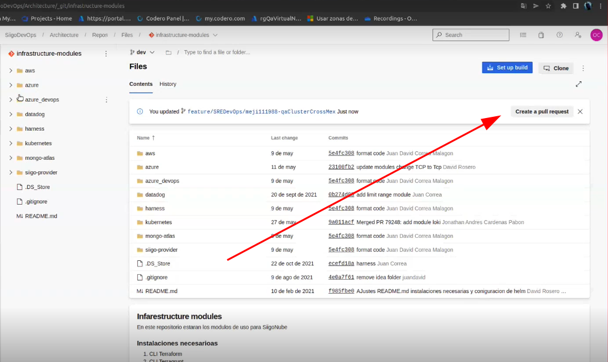
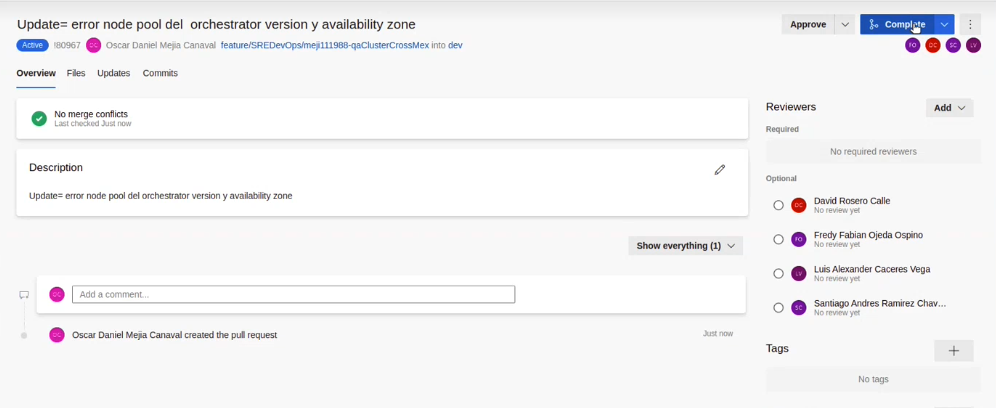

# Git Flow en el repo de IaC
 
## Preparar el entorno de desarrollo
Antes de empezar a trabajar en una nueva `característica` se debe tener  limpio el repositorio local, con los últimos cambios del repositorio remoto,y estar en una nueva rama.
 
**Nota** *Recuerda que la rama principal de `IaC` es `infraestructure-code`*
 
 
1. Definir la rama principal, en este caso es `infrastructure-code`
```bash
$ principal_branch=infrastructure-code
```
2. Limpiar los cambios locales: *Esto elimina todos los cambios que están por fuera del commit.*
```bash
$ git stash
```
3. Ubicarse en la rama `principal`
 
```bash
$ git checkout $principal_branch
```
2. Bajar los cambios remotos
```bash
$ git pull origin $principal_branch
```
3. Crear una nueva rama para los cambios que se van a realizar.
 
   Nota: Tener en cuenta el estándar de nombramiento
   feature/{tribu}/{username}/{country}/{env}/{feature-description}
 
```bash
$ branch_name=feature/SRE/rami802288/col/qa/firewall-paloalto
$ git checkout -b $branch_name
```
 
**En este punto ya se pueden empezar a realizar los cambios o a crear la nueva funcionalidad, cuando los cambios hayan sido exitosos se procede al siguiente paso para integrarlos.**
 
 
## Subir los cambios al repositorio
 
 
1. Ver los cambios locales
```sh
$ git status
```
2. Agregar los cambios importantes al commit, use `git add -A` si se quieren agregar todos los cambios
```sh
$ git add file1 folder1 ...
```
3. Hacer un commit y subirlo
```sh
$ git commit -m "message description"
$ git push origin  $branch_name
```
 
## Crear un pull requests y aprobarlo
1. Se debe crear un pull requests de la nueva rama a la rama principal

2. Este pull requests se comparte con los compañeros de trabajo para que lo revisen y lo aprueben.
 
3. Cuando haya sido aprobado se procede a integrar a la rama principal.

 
 
## Bajar el nuevo cambio de la rama principal
 
1. Ubicarse en la rama `principal`
```bash
git checkout $principal_branch
```
2. Bajar los cambios remotos
```sh
git pull origin $principal_branch
```
 
 
## Crear un tag de la nueva versión y subirlo al repositorio
Esta no se está realizando en este repositorio por el momento
 

