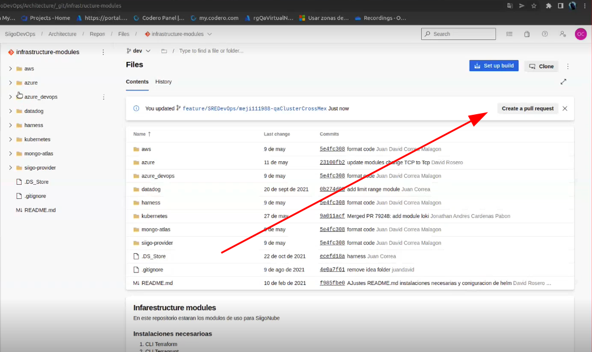
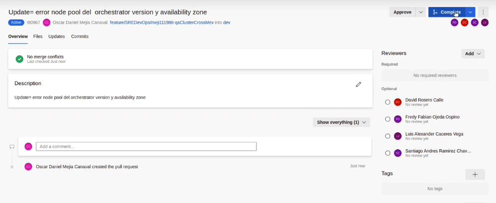
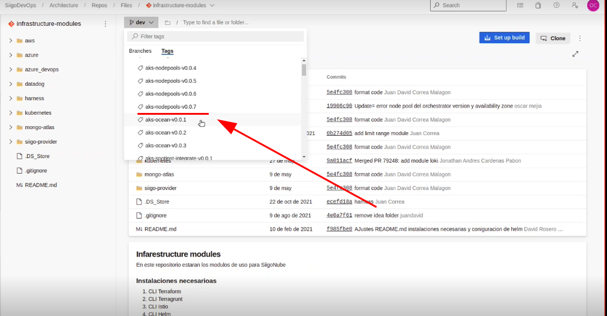

# Git Flow en el repo de Infraestrucure Modules

## Preparar el entorno de desarrollo
Antes de empezar a trabajar en una nueva `caracteristica` se debe tener  limpio el repositorio local, con los ultimos cambios del repositorio remoto,y estar en una nueva rama.

**Nota** *Recuerda que la rama principal de `Infraestructure-Modules` es `dev`*


1. Definir la rama principal, en este caso es `dev`
```bash 
$ principal_branch=dev 
```
2. Limpiar los cambios locales: *Esto elimina todos los cambios que esten por fuera del commit.*
```bash
$ git stash
```
3. Ubicarse en la rama `principal`

```bash 
$ git checkout $principal_branch
```
2. Bajar los cambios remotos
```bash
$ git pull origin $principal_branch
```
3. Crear una nueva rama para los cambios que se van a realizar. 

    Nota: Tener en cuenta el estandar de nombramiento
    feature/{tribu}/{username}/{module}/{feature-description}

```bash
$ branch_name=feature/SRE/rami802288/aks_node_pools/some_change
$ git checkout -b $branch_name
```

**En este punto ya se pueden empezar a realizar los cambios o a crear la nueva funcionalidad, cuando los cambios hayan sido exitosos se procede al siguiente paso para integrarlos.**


## Subir los cambios al repositorio


1. Ver los cambios locales
```sh
$ git status 
```
2. Agregar los cambios importantes al commit, usar `git add -A` si se quieren agregar todos los cambios
```sh
$ git add file1 folder1 ...
```
3. Hacer un commit y subirlo
```sh
$ git commit -m "message description"
$ git push origin  $branch_name
```

## Crear un pull requests y aprobarlo
1. Se debe crear un pull requests de la nueva rama a la rama principal

2. Este pull requests se comparte con los companeros de trabajo para que lo revisen y lo aprueben.

3. Cuando haya sido aprobado se procede a integrar a la rama principal.



## Bajar el nuevo cambio de la rama principal

1. Ubicarse en la rama `principal`
```bash 
git checkout $principal_branch
```
2. Bajar los cambios remotos
```sh
git pull origin $principal_branch
```


## Crear un tag de la nueva version y subirlo al repositorio


1. Buscar el ultimo tag del modulo, en este ejemplo el modulo es aks_node_pools

2. Definir el nombre del tag
```bash
# tag_name={modulename}-{new_version}
$ tag_name=aks_node_pools-v0.0.8
```
2. Crear el nuevo tag 
```bash 
$ git tag -a  tag_name  -m "message" 
```
3. Subir el tag al repositorio remoto
```bash
$ git pull origin tag_name
```
[`Git Flow`](https://www.youtube.com/watch?v=abtqhoMqCWY){target=_blank}


```console
informatica@rami802288-11:~/dev/sre_meetings_directory$ ls
```
```bash start_symbol=$
informatica@rami802288-11:~/dev/sre_meetings_directory$ ls
```

```py
def a(s):
    print(s)
```